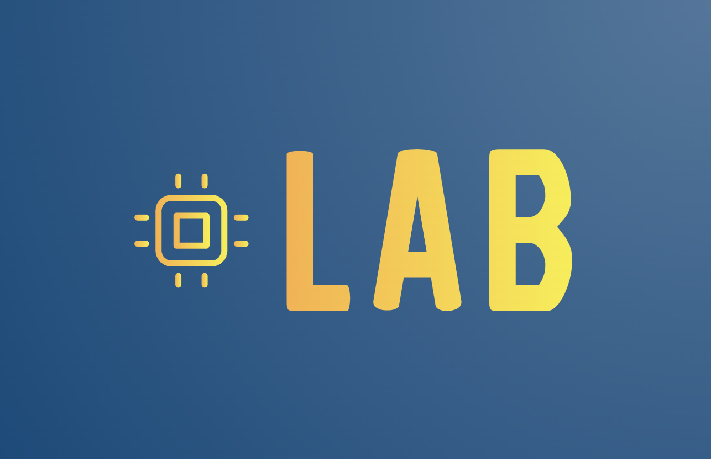
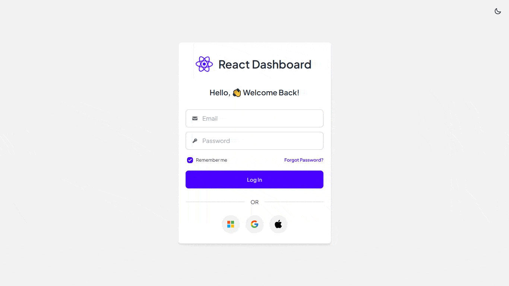

<br/>
<p align="center">
    <a href="https://react-admin-ui-v1.vercel.app/" target="_blank">
        
    </a>
</p>

<br/>
<p align="center">
    <a href="LICENSE" target="_blank"></a>
    <a></a>
    <a></a>
   
</p>
<br/>

Lab Admin UI is a prototype project designed to showcase the integration of AI and Machine learning(ML.NET) into a dashboard built with React, Typescript and Node.

The dashboard was inspired by [React Admin UI](https://react-admin-ui-v1.vercel.app/)

The Ai is a combination of customised machine learning engine powered by Microsoft ML.NET and an LLM agent powered by LangChain.js

<br/>
<p align="center">
    
</p>
<br/>


## 🚀&nbsp; Installation and How to use

See below for a quickstart installation and usage examples.

<details open>
<summary>Backend</summary>

Install all dependencies listed in `package.json` inside backend directory.

```bash
cd backend
```

```bash
npm install
```

By default, I already deployed the API to run in Vercel environment. The live API can be accessed from [https://react-admin-ui-v1-api.vercel.app/](https://react-admin-ui-v1-api.vercel.app/). However, in case you would like to configure the backend by yourself, you can run below.

```bash
nodemon ./src/index.ts
```

And the API can be accessed locally from [http://localhost:5000](http://localhost:5000).

</details>

<details open>
<summary>Frontend</summary>

Install all dependencies listed in `package.json` inside frontend directory.

```bash
cd frontend
```

```bash
npm install
```

```bash
npm run dev
```

If you would like to change the default API endpoint, you can go to [ApiCollection.tsx](/frontend/src/api/ApiCollection.tsx).

And then, the app can be accessed from [http://localhost:5173/](http://localhost:5173/).

</details>

## 📫&nbsp; Have a question? Would like to chat? Ran into a problem?

Obviously you can always **reach out to me directly** via a formal approach such as [Email](mailto:francis@jaftagroup.com) or [LinkedIn](https://www.linkedin.com/in/francis-adediran/).


